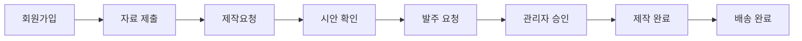

# 스타트패키지 시스템 기능 및 로직 점검 보고서

**날짜**: 2025-10-25
**분석 대상**: 전체 시스템 (프론트엔드 + 백엔드 + 알림)
**평가 점수**: 7.0/10 (양호, 보안 개선 시급)

---

## 📊 Executive Summary

스타트패키지는 명확한 비즈니스 플로우와 통합 알림 시스템을 갖춘 잘 설계된 애플리케이션입니다. 그러나 **파일 업로드 보안**, **입력 검증**, **타입 안전성** 등 보안 관련 개선이 시급합니다.

### 주요 발견 사항
- ✅ **강점**: 체계적인 워크플로우, 멀티채널 알림, 자동화
- 🔴 **Critical 이슈**: 파일 업로드 보안, 입력 검증 누락, 타입 안전성 부족
- 🟡 **개선 필요**: 트랜잭션 처리, 에러 로깅, 알림 재시도

---

## 1. 주요 비즈니스 플로우

### 1.1 사용자 여정 (User Journey)



#### 상세 단계별 분석

**1단계: 회원가입** (`/api/auth/signup`)
- **입력**: 이름, 연락처, 이메일, 비밀번호, 기수
- **자동 처리**:
  - 5개 기본 워크플로우 생성 (명함, 명찰, 대봉투, 계약서 표지/내지)
  - 빈 Submission 레코드 생성
  - 텔레그램 관리자 알림
- **검증 상태**: 🔴 **이메일/연락처 형식 검증 없음**

**2단계: 자료 제출** (`/api/submission`)
- **필수 항목**: 브랜드명, 업종, 주소, 사업자등록증, 프로필사진, 명함시안
- **선택 항목**: 로고, 홈페이지, 마케팅 서류
- **동적 워크플로우 생성**:
  - 로고 정보 입력 시 → 로고 워크플로우 추가
  - 홈페이지 정보 입력 시 → 홈페이지 워크플로우 추가
- **슬랙 연동**: 변경사항 실시간 업로드
- **검증 상태**: ✅ Zod 스키마 적용

**3단계: 제작요청** (isComplete: true)
- **검증**: 필수 항목 완료 여부
- **상태 변경**: 워크플로우 상태 → "시안중"
- **슬랙 채널 생성**: `{기수}_{이름}_{브랜드명}` 포맷
- **알림 발송**:
  - ✅ 텔레그램 관리자 알림
  - ✅ SMS 사용자 알림 ("영업일 2일 이내 제작")
  - ✅ 슬랙 제작 정보 푸시
- **예정일 계산**: 영업일 기준 3일 후

**4단계: 시안 확인**
- **관리자 작업**: 시안 파일 업로드 (`/api/admin/upload-design`)
- **상태 변경**: "시안중" → "발주대기"
- **알림**:
  - ✅ 이메일 자동 발송
  - ✅ SMS 자동 발송
  - ✅ 슬랙 로그 기록
- **사용자 작업**: 시안 확인 후 발주 버튼

**5단계: 발주 요청** (`/api/workflows/[id]/order`)
- **상태 변경**: "발주대기" → "발주요청"
- **알림**:
  - ✅ 텔레그램 관리자 알림
  - ✅ 슬랙 발주 로그
  - ✅ 사용자 이메일 (접수 확인)
- **대기**: 관리자 승인

**6단계: 관리자 승인** (`/api/admin/workflows/update`)
- **상태 변경**: "발주요청" → "발주완료"
- **예상 도착일 계산**: 인쇄물 타입별 영업일
  - 명함: 3일
  - 명찰: 5일
  - 봉투: 7일
  - 기타: 5일
- **알림**:
  - ✅ 이메일 자동 발송
  - ❌ SMS 수동 발송 (관리자 버튼)

**7단계: 제작/배송 완료**
- **택배 정보 입력**: 택배사, 송장번호
- **알림**:
  - ✅ 이메일 자동 발송
  - ❌ SMS 수동 발송

### 1.2 관리자 워크플로우

**권한 체계**:
```
super (슈퍼관리자)
  ↓
designer (디자이너) → 시안 제작/업로드
  ↓
operator (운영자) → 발주 승인, 배송 관리
```

**주요 작업**:
1. **알림 수신**: 텔레그램 (즉시) + 슬랙 (기록)
2. **시안 제작**:
   - 슬랙 채널에서 제출 정보 확인
   - 시안 파일 업로드
   - 이메일/SMS 자동 발송
3. **발주 관리**:
   - 발주 요청 확인
   - 승인/반려
   - 예상 도착일 자동 계산
4. **배송 관리**:
   - 택배 정보 입력
   - 이메일 자동 발송
5. **커뮤니케이션**: 스레드 답변

---

## 2. 데이터베이스 스키마 분석

### 2.1 ERD (Entity Relationship Diagram)

```
┌─────────────┐
│   Cohort    │ 기수
│  - id       │
│  - name     │
│  - isActive │
└──────┬──────┘
       │ 1:N
       ▼
┌─────────────┐
│    User     │ 사용자
│  - id       │
│  - 이름     │
│  - 연락처   │
│  - cohortId │
└──┬───┬───┬──┘
   │   │   │
   │   │   └─────────┐
   │   │             │ 1:N
   │   │             ▼
   │   │      ┌──────────────┐
   │   │      │ CommThread   │ 커뮤니케이션 스레드
   │   │      │  - userId    │
   │   │      └──────┬───────┘
   │   │             │ 1:N
   │   │             ▼
   │   │      ┌──────────────┐
   │   │      │ CommMessage  │ 메시지
   │   │      └──────────────┘
   │   │
   │   │ 1:1
   │   ▼
   │ ┌──────────────┐
   │ │ Submission   │ 제출 정보
   │ │  - userId    │
   │ │  - 브랜드명  │
   │ │  - isComplete│
   │ └──────────────┘
   │
   │ 1:N
   ▼
┌──────────────┐
│  Workflow    │ 워크플로우
│  - id        │
│  - userId    │
│  - type      │
│  - status    │
└──┬────┬──────┘
   │    │
   │    │ 1:N
   │    ▼
   │ ┌──────────────┐
   │ │DesignHistory │ 시안 이력
   │ │  - version   │
   │ │  - fileUrl   │
   │ └──────────────┘
   │
   │ 1:N
   ▼
┌──────────────┐
│ WorkflowLog  │ 로그
│  - stage     │
│  - status    │
└──────────────┘
```

### 2.2 스키마 강점

1. **관계 설정**
   - ✅ `onDelete: Cascade` 적절히 사용
   - ✅ UNIQUE 제약 조건 (email, cohort name)
   - ✅ 1:1, 1:N 관계 명확

2. **인덱싱 전략**
   - ✅ `@@index([userId])` - 사용자별 조회 최적화
   - ✅ `@@index([status])` - 상태별 필터링
   - ✅ `@@index([createdAt])` - 시간순 정렬

3. **이력 추적**
   - ✅ `WorkflowLog` - 모든 상태 변경 기록
   - ✅ `DesignHistory` - 시안 버전 관리
   - ✅ `Notification` - 발송 이력

4. **한글 필드명**
   - 가독성 향상 (이름, 연락처, 브랜드명 등)
   - 비즈니스 도메인 명확

### 2.3 개선 권장사항

1. 🟡 **Enum 타입 활용**
   ```prisma
   // 현재
   status String // "시안중", "발주대기" 등

   // 권장
   enum WorkflowStatus {
     DRAFTING      // 시안중
     READY_TO_ORDER // 발주대기
     ORDER_REQUESTED // 발주요청
     ORDERED       // 발주완료
     COMPLETED     // 제작완료
   }

   status WorkflowStatus @default(DRAFTING)
   ```

2. 🟡 **파일 관리 개선**
   ```prisma
   // 현재
   fileUrl String?

   // 권장
   model File {
     id        String   @id @default(cuid())
     filename  String
     url       String
     mimeType  String
     size      Int
     createdAt DateTime @default(now())

     // 관계
     profileUser  User?     @relation(...)
     designHistory DesignHistory? @relation(...)
   }
   ```

3. 🟡 **Notification 테이블 확장**
   ```prisma
   model Notification {
     id        String   @id @default(cuid())
     userId    String
     type      NotificationType // EMAIL, SMS, SLACK, TELEGRAM
     channel   String           // 채널명
     title     String
     message   String
     status    NotificationStatus // PENDING, SENT, FAILED
     sentAt    DateTime?
     failReason String?

     user User @relation(...)
   }

   enum NotificationType {
     EMAIL
     SMS
     SLACK
     TELEGRAM
   }

   enum NotificationStatus {
     PENDING
     SENT
     FAILED
   }
   ```

---

## 3. API 엔드포인트 검증

### 3.1 인증/인가 평가

| API 경로 | 인증 | 권한 | 입력 검증 | 에러 처리 | 평가 |
|---------|------|------|----------|----------|------|
| `POST /api/auth/signup` | ❌ Public | - | 🔴 미흡 | ✅ | 🔴 Critical |
| `POST /api/auth/signin` | - | - | ⚠️ 기본 | ✅ | 🟡 Warning |
| `GET /api/submission` | ✅ Session | User | ✅ | ✅ | ✅ Good |
| `POST /api/submission` | ✅ Session | User | ✅ Zod | ✅ | ✅ Good |
| `POST /api/upload` | ✅ Session | User | ⚠️ 부분적 | ✅ | 🟡 Warning |
| `GET /api/workflows` | ✅ Session | User | ✅ | ✅ | ✅ Good |
| `POST /api/workflows/[id]/order` | ✅ Session | User + Owner | ✅ | ✅ | ✅ Good |
| `POST /api/admin/upload-design` | ✅ Session | Admin | 🔴 미흡 | ✅ | 🔴 Critical |
| `POST /api/admin/workflows/update` | ✅ Session | Admin | ⚠️ 부분적 | ✅ | 🟡 Warning |

### 3.2 Critical 이슈 상세

#### 🔴 Issue #1: 회원가입 입력 검증 부재

**파일**: `/api/auth/signup/route.ts`

**현재 코드**:
```typescript
const { 이름, 연락처, 이메일, password, cohortId } = await req.json();

// 검증 없이 바로 생성
const hashedPassword = await hash(password, 10);
const user = await prisma.user.create({
  data: { 이름, 연락처, 이메일, password: hashedPassword, cohortId }
});
```

**문제점**:
- 이메일 형식 검증 없음
- 연락처 형식 검증 없음
- 비밀번호 강도 검증 없음
- SQL Injection 방어 (Prisma에만 의존)

**권장 수정**:
```typescript
import { z } from "zod";

const signupSchema = z.object({
  이름: z.string().min(2, "이름은 2자 이상이어야 합니다").max(50),
  연락처: z.string().regex(/^010\d{8}$/, "올바른 연락처 형식이 아닙니다"),
  이메일: z.string().email("올바른 이메일 형식이 아닙니다"),
  password: z.string()
    .min(8, "비밀번호는 8자 이상이어야 합니다")
    .regex(/^(?=.*[a-z])(?=.*[A-Z])(?=.*\d)/, "대소문자와 숫자를 포함해야 합니다"),
  cohortId: z.string().cuid("올바른 기수 ID가 아닙니다"),
});

// API 핸들러
const body = await req.json();
const validatedData = signupSchema.parse(body); // throws on invalid

// 연락처 하이픈 제거
const cleanPhone = validatedData.연락처.replace(/-/g, "");

// 이메일 중복 체크
const existingUser = await prisma.user.findFirst({
  where: {
    OR: [
      { 이메일: validatedData.이메일 },
      { 연락처: cleanPhone }
    ]
  }
});

if (existingUser) {
  return NextResponse.json(
    { error: "이미 가입된 이메일 또는 연락처입니다" },
    { status: 400 }
  );
}
```

#### 🔴 Issue #2: 파일 업로드 보안

**파일**: `/api/upload/route.ts`, `/api/admin/upload-design/route.ts`

**현재 코드**:
```typescript
const file = formData.get("file") as File;

// 크기만 체크
if (file.size > 10 * 1024 * 1024) {
  return NextResponse.json({ error: "파일이 너무 큽니다" }, { status: 400 });
}

// MIME 타입 검증 없음!
const filename = `${field}_${Date.now()}.${file.name.split(".").pop()}`;
const filepath = path.join(uploadDir, filename);
await fs.writeFile(filepath, buffer);
```

**취약점**:
1. **악성 파일 업로드**: MIME 타입 검증 없음
2. **Path Traversal**: `../../etc/passwd` 같은 경로 가능
3. **확장자 검증 부재**: `.exe`, `.sh` 등 실행 파일 업로드 가능

**권장 수정**:
```typescript
import { z } from "zod";
import path from "path";

// 허용된 MIME 타입
const ALLOWED_IMAGE_TYPES = [
  "image/jpeg",
  "image/jpg",
  "image/png",
  "image/webp"
];

const ALLOWED_DOCUMENT_TYPES = [
  "application/pdf",
  "application/msword",
  "application/vnd.openxmlformats-officedocument.wordprocessingml.document"
];

const ALLOWED_TYPES = [...ALLOWED_IMAGE_TYPES, ...ALLOWED_DOCUMENT_TYPES];

// 파일 검증
const file = formData.get("file") as File;

// 1. 크기 검증
const MAX_SIZE = 10 * 1024 * 1024; // 10MB
if (file.size > MAX_SIZE) {
  return NextResponse.json(
    { error: "파일 크기는 10MB를 초과할 수 없습니다" },
    { status: 400 }
  );
}

// 2. MIME 타입 검증
if (!ALLOWED_TYPES.includes(file.type)) {
  return NextResponse.json(
    { error: "허용되지 않는 파일 형식입니다" },
    { status: 400 }
  );
}

// 3. 파일명 sanitization (Path Traversal 방어)
const originalName = file.name.replace(/[^a-zA-Z0-9._-]/g, "");
const ext = path.extname(originalName);
const safeName = `${field}_${Date.now()}${ext}`;

// 4. 저장 경로 검증
const uploadDir = path.join(process.cwd(), "public", "uploads", userId);
const filepath = path.join(uploadDir, safeName);

// 저장 경로가 uploadDir 내부인지 확인 (Path Traversal 방어)
const resolvedPath = path.resolve(filepath);
const resolvedUploadDir = path.resolve(uploadDir);
if (!resolvedPath.startsWith(resolvedUploadDir)) {
  return NextResponse.json(
    { error: "잘못된 파일 경로입니다" },
    { status: 400 }
  );
}

// 5. 디렉토리 생성 (재귀)
await fs.mkdir(uploadDir, { recursive: true });

// 6. 파일 저장
const buffer = Buffer.from(await file.arrayBuffer());
await fs.writeFile(resolvedPath, buffer);
```

#### 🔴 Issue #3: 타입 안전성 부족

**문제**: `(session.user as any)` 패턴 남용

**영향을 받는 파일**: 거의 모든 API 라우트

**현재 코드**:
```typescript
const session = await auth();
const userId = (session?.user as any)?.id;  // 런타임 에러 위험
const userRole = (session?.user as any)?.role;  // 타입 안전성 상실
```

**권장 수정**:

1. **타입 정의 확장**:
```typescript
// types/next-auth.d.ts
import { DefaultSession } from "next-auth";

declare module "next-auth" {
  interface Session {
    user: {
      id: string;
      role: "user" | "super" | "designer" | "operator";
      cohortId?: string;
      userType?: string;
    } & DefaultSession["user"]
  }

  interface User {
    id: string;
    role: "user" | "super" | "designer" | "operator";
    cohortId?: string;
    userType?: string;
  }
}
```

2. **타입 가드 함수**:
```typescript
// lib/auth/guards.ts
import { Session } from "next-auth";

export function isAuthenticated(session: Session | null): session is Session {
  return !!session?.user?.id;
}

export function isAdmin(session: Session | null): boolean {
  return isAuthenticated(session) &&
         ["super", "designer", "operator"].includes(session.user.role);
}

export function hasRole(
  session: Session | null,
  roles: string[]
): boolean {
  return isAuthenticated(session) &&
         roles.includes(session.user.role);
}

// 사용 예시
const session = await auth();

if (!isAuthenticated(session)) {
  return NextResponse.json({ error: "Unauthorized" }, { status: 401 });
}

// 이제 session.user.id는 타입 안전
const userId = session.user.id;  // ✅ string
const userRole = session.user.role;  // ✅ "user" | "super" | ...
```

---

## 4. 알림 시스템 분석

### 4.1 멀티채널 전략

| 채널 | 대상 | 용도 | 자동/수동 | 평가 |
|-----|------|------|----------|------|
| **Slack** | 관리자 | 진행 기록, 파일 공유 | 자동 | ✅ 우수 |
| **Telegram** | 관리자 | 즉시 알림 | 자동 | ✅ 우수 |
| **SMS** | 사용자 | 주요 단계 알림 | 혼합 | 🟡 개선 필요 |
| **Email** | 사용자 | 상세 정보 | 자동 | ✅ 양호 |

### 4.2 알림 플로우 매트릭스

| 이벤트 | Slack | Telegram | SMS | Email |
|--------|-------|----------|-----|-------|
| **회원가입** | ❌ | ✅ 관리자 | ❌ | ❌ |
| **자료 제출 완료** | ✅ 채널생성+푸시 | ✅ 관리자 | ✅ 사용자 | ❌ |
| **시안 완료** | ✅ 파일+로그 | ❌ | ✅ 사용자 | ✅ 사용자 |
| **발주 요청** | ✅ 로그 | ✅ 관리자 | ❌ | ✅ 사용자 |
| **발주 승인** | ✅ 로그 | ❌ | 🟡 수동 | ✅ 사용자 |
| **배송 정보** | ✅ 로그 | ❌ | 🟡 수동 | ✅ 사용자 |

### 4.3 Slack 통합 (우수 사례)

**구현 강점**:
1. **자동 채널 생성**:
   ```typescript
   const channelName = `${cohortName}_${userName}_${brandName}`
     .toLowerCase()
     .replace(/[^a-z0-9가-힣_-]/g, "");

   await client.conversations.create({
     name: channelName,
     is_private: false
   });
   ```

2. **구조화된 메시지**:
   ```typescript
   await client.chat.postMessage({
     channel: channelId,
     blocks: [
       {
         type: "header",
         text: { type: "plain_text", text: "📋 제작 정보" }
       },
       {
         type: "section",
         fields: [
           { type: "mrkdwn", text: `*브랜드명:*\n${data.브랜드명}` },
           { type: "mrkdwn", text: `*업종:*\n${data.업종}` }
         ]
       }
     ]
   });
   ```

3. **파일 업로드**:
   ```typescript
   await client.files.uploadV2({
     channel_id: channelId,
     file: buffer,
     filename: filename,
     title: title
   });
   ```

### 4.4 개선 권장사항

#### 🟡 Issue #4: SMS 발송 일관성

**문제**: 일부 알림은 자동, 일부는 수동

**현재 상태**:
- ✅ 자동: 자료 제출 완료, 시안 완료
- ❌ 수동: 발주 승인, 배송 정보

**권장**:
```typescript
// lib/notification/smsTemplates.ts
export const SMS_TEMPLATES = {
  SUBMISSION_COMPLETE: "디자인 시안 제작요청이 접수되었습니다.\n영업일 2일 이내 제작 후 안내드리겠습니다.",
  DESIGN_READY: "디자인 시안이 완료되었습니다.\n대시보드에서 확인하신 후 발주 요청해주세요.",
  ORDER_APPROVED: "발주가 승인되어 인쇄소에 발주되었습니다.\n제작이 시작됩니다.",
  SHIPPING_INFO: (trackingNumber: string) =>
    `제작이 완료되어 발송되었습니다.\n송장번호: ${trackingNumber}`
};

// 자동 발송 로직
async function handleOrderApproval(workflowId: string) {
  // ... 발주 승인 처리 ...

  // SMS 자동 발송
  if (user.연락처) {
    await sendSMS(user.연락처, SMS_TEMPLATES.ORDER_APPROVED);
  }
}
```

#### 🟡 Issue #5: 알림 실패 처리

**문제**: 알림 실패 시 재시도 로직 없음

**권장**: 재시도 큐 구현

```typescript
// lib/notification/queue.ts
import { PrismaClient } from "@prisma/client";

interface NotificationJob {
  id: string;
  type: "EMAIL" | "SMS" | "SLACK" | "TELEGRAM";
  recipient: string;
  payload: any;
  retryCount: number;
  maxRetries: number;
  status: "PENDING" | "PROCESSING" | "SENT" | "FAILED";
}

export class NotificationQueue {
  private prisma = new PrismaClient();

  async enqueue(job: Omit<NotificationJob, "id" | "retryCount" | "status">) {
    return await this.prisma.notificationQueue.create({
      data: {
        ...job,
        retryCount: 0,
        status: "PENDING"
      }
    });
  }

  async process() {
    const jobs = await this.prisma.notificationQueue.findMany({
      where: {
        status: "PENDING",
        retryCount: { lt: maxRetries }
      },
      take: 10
    });

    for (const job of jobs) {
      try {
        await this.send(job);

        await this.prisma.notificationQueue.update({
          where: { id: job.id },
          data: { status: "SENT" }
        });
      } catch (error) {
        await this.prisma.notificationQueue.update({
          where: { id: job.id },
          data: {
            status: job.retryCount >= job.maxRetries - 1 ? "FAILED" : "PENDING",
            retryCount: { increment: 1 }
          }
        });
      }
    }
  }
}
```

---

## 5. 파일 업로드 시스템

### 5.1 현재 구조

**저장 위치**:
- 사용자 파일: `/public/uploads/{userId}/{field}_{timestamp}.{ext}`
- 시안 파일: `/public/uploads/designs/{workflowId}/{timestamp}-{filename}`

**문제점**:
1. 🔴 **공개 접근**: `/public` 폴더는 누구나 접근 가능
2. 🔴 **파일 삭제 없음**: 변경 시 이전 파일 누적
3. 🟡 **용량 제한 없음**: 사용자별 쿼터 관리 부재

### 5.2 권장 개선안

#### 방안 1: Private 저장소 + 서명된 URL

```typescript
// lib/storage/fileManager.ts
import { S3Client, PutObjectCommand } from "@aws-sdk/client-s3";
import { getSignedUrl } from "@aws-sdk/s3-request-presigner";

export class FileManager {
  private s3 = new S3Client({
    region: process.env.AWS_REGION,
    credentials: {
      accessKeyId: process.env.AWS_ACCESS_KEY_ID!,
      secretAccessKey: process.env.AWS_SECRET_ACCESS_KEY!
    }
  });

  async upload(file: File, userId: string, field: string) {
    const key = `users/${userId}/${field}/${Date.now()}-${file.name}`;

    await this.s3.send(new PutObjectCommand({
      Bucket: process.env.AWS_BUCKET_NAME,
      Key: key,
      Body: Buffer.from(await file.arrayBuffer()),
      ContentType: file.type
    }));

    return key;
  }

  async getSignedUrl(key: string, expiresIn: number = 3600) {
    const command = new GetObjectCommand({
      Bucket: process.env.AWS_BUCKET_NAME,
      Key: key
    });

    return await getSignedUrl(this.s3, command, { expiresIn });
  }

  async delete(key: string) {
    await this.s3.send(new DeleteObjectCommand({
      Bucket: process.env.AWS_BUCKET_NAME,
      Key: key
    }));
  }
}
```

#### 방안 2: Vercel Blob (간단한 대안)

```typescript
import { put, del } from "@vercel/blob";

export async function uploadFile(file: File, path: string) {
  const blob = await put(path, file, {
    access: "public",
    addRandomSuffix: true
  });

  return blob.url;
}

export async function deleteFile(url: string) {
  await del(url);
}
```

### 5.3 파일 크기 및 타입 검증

```typescript
// lib/upload/validators.ts
import { z } from "zod";

export const MAX_FILE_SIZE = 10 * 1024 * 1024; // 10MB

export const MIME_TYPES = {
  image: ["image/jpeg", "image/png", "image/webp"],
  document: ["application/pdf", "application/msword"],
  all: ["image/jpeg", "image/png", "image/webp", "application/pdf"]
} as const;

export function validateFile(
  file: File,
  options: {
    maxSize?: number;
    allowedTypes?: string[];
  } = {}
) {
  const maxSize = options.maxSize || MAX_FILE_SIZE;
  const allowedTypes = options.allowedTypes || MIME_TYPES.all;

  if (file.size > maxSize) {
    throw new Error(`파일 크기는 ${maxSize / 1024 / 1024}MB를 초과할 수 없습니다`);
  }

  if (!allowedTypes.includes(file.type)) {
    throw new Error("허용되지 않는 파일 형식입니다");
  }

  return true;
}

// 사용 예시
const file = formData.get("file") as File;
validateFile(file, {
  maxSize: 5 * 1024 * 1024,
  allowedTypes: MIME_TYPES.image
});
```

---

## 6. 보안 및 에러 처리

### 6.1 인증/인가 평가

**현재 구현**:
```typescript
// ✅ 비밀번호 해싱
const hashedPassword = await hash(password, 10);  // bcrypt, 10 rounds

// ✅ JWT 세션
const session = await auth();

// ✅ 리소스 소유권 확인
const workflow = await prisma.workflow.findUnique({ where: { id } });
if (workflow.userId !== session.user.id) {
  return NextResponse.json({ error: "Forbidden" }, { status: 403 });
}

// ✅ 관리자 권한 확인
if (!["super", "designer", "operator"].includes(session.user.role)) {
  return NextResponse.json({ error: "Forbidden" }, { status: 403 });
}
```

**취약점**:
- 🟡 비밀번호 복잡도 정책 없음
- 🟡 계정 잠금 정책 없음 (무차별 대입 공격 취약)
- 🟡 세션 만료 시간 불명확

### 6.2 입력 검증 현황

| 검증 영역 | 구현 상태 | 평가 |
|----------|----------|------|
| 이메일 형식 | ❌ | 🔴 |
| 전화번호 형식 | ⚠️ 부분적 (하이픈 제거만) | 🟡 |
| 비밀번호 강도 | ❌ | 🔴 |
| 파일 타입 | ❌ | 🔴 |
| 파일 크기 | ✅ | ✅ |
| SQL Injection | ✅ Prisma ORM | ✅ |
| XSS | ✅ React escaping | ✅ |
| CSRF | ⚠️ Next.js 기본 | 🟡 |

### 6.3 에러 처리 패턴

**현재**:
```typescript
try {
  // 비즈니스 로직
} catch (error) {
  console.error("에러:", error);
  return NextResponse.json(
    { error: "Internal server error" },
    { status: 500 }
  );
}
```

**문제점**:
- 🔴 에러 로그 영구 저장소 없음
- 🟡 스택 추적 노출 가능성
- 🟡 에러 메시지 일관성 부족

**권장 개선**:

```typescript
// lib/errors/handler.ts
import * as Sentry from "@sentry/nextjs";

export class AppError extends Error {
  constructor(
    public message: string,
    public statusCode: number = 500,
    public isOperational: boolean = true
  ) {
    super(message);
  }
}

export function handleError(error: unknown) {
  // 운영 에러 (예상된 에러)
  if (error instanceof AppError && error.isOperational) {
    console.error("Operational Error:", error.message);

    return NextResponse.json(
      { error: error.message },
      { status: error.statusCode }
    );
  }

  // 프로그래밍 에러 (예상치 못한 에러)
  console.error("Programming Error:", error);
  Sentry.captureException(error);  // Sentry로 전송

  return NextResponse.json(
    { error: "서버 오류가 발생했습니다. 잠시 후 다시 시도해주세요." },
    { status: 500 }
  );
}

// 사용 예시
try {
  const user = await prisma.user.findUnique({ where: { id } });

  if (!user) {
    throw new AppError("사용자를 찾을 수 없습니다", 404);
  }

  // ...
} catch (error) {
  return handleError(error);
}
```

### 6.4 트랜잭션 처리

**현재 문제**:
```typescript
// ❌ 원자성 보장 안 됨
await prisma.submission.update({ ... });
await prisma.workflow.updateMany({ ... });  // 실패 시 rollback 안 됨
await notificationService.handleSubmissionComplete({ ... });  // 실패 시?
```

**권장 개선**:
```typescript
// ✅ 트랜잭션 사용
await prisma.$transaction(async (tx) => {
  // 1. Submission 업데이트
  const submission = await tx.submission.update({
    where: { userId },
    data: { isComplete: true }
  });

  // 2. Workflow 상태 변경
  await tx.workflow.updateMany({
    where: { userId, status: "자료대기" },
    data: {
      status: "시안중",
      예상시안일: calculateBusinessDays(3)
    }
  });

  // 3. Slack 채널 ID 저장
  if (slackChannelId) {
    await tx.user.update({
      where: { id: userId },
      data: { slackChannelId }
    });
  }
});

// 4. 외부 서비스 호출은 트랜잭션 밖에서
try {
  await notificationService.handleSubmissionComplete({ ... });
} catch (error) {
  // 알림 실패해도 트랜잭션은 커밋됨
  console.error("알림 발송 실패:", error);
}
```

---

## 7. 발견된 이슈 종합

### 🔴 Critical (즉시 수정 필요)

| # | 이슈 | 파일 | 영향도 | 해결 우선순위 |
|---|------|------|--------|--------------|
| 1 | 파일 업로드 보안 | `/api/upload/route.ts` | **HIGH** | P0 (즉시) |
| 2 | 회원가입 입력 검증 | `/api/auth/signup/route.ts` | **HIGH** | P0 (즉시) |
| 3 | 타입 안전성 부족 | 전역 (as any 남용) | **MEDIUM** | P1 (1주) |
| 4 | 에러 로깅 부재 | 전역 | **MEDIUM** | P1 (1주) |

### 🟡 Warning (개선 권장)

| # | 이슈 | 파일 | 영향도 | 해결 우선순위 |
|---|------|------|--------|--------------|
| 5 | 트랜잭션 미사용 | `/api/submission/route.ts` | MEDIUM | P2 (2주) |
| 6 | 워크플로우 상태 검증 | `/api/admin/workflows/update` | LOW | P2 (2주) |
| 7 | SMS 발송 일관성 | 알림 시스템 | LOW | P2 (2주) |
| 8 | 파일 삭제 로직 | 파일 업로드 | LOW | P3 (1개월) |
| 9 | 환경변수 검증 | 전역 | LOW | P3 (1개월) |
| 10 | 비밀번호 정책 | `/api/auth/signup` | MEDIUM | P2 (2주) |

### 🟢 Info (참고사항)

| # | 개선 사항 | 설명 | 우선순위 |
|---|----------|------|---------|
| 11 | Notification 테이블 | 모든 알림 통합 관리 | P4 (선택) |
| 12 | Prisma Enum | 상태 타입을 Enum으로 | P4 (선택) |
| 13 | API 응답 일관성 | 통일된 포맷 정의 | P4 (선택) |
| 14 | 페이지네이션 | 목록 조회 최적화 | P4 (선택) |
| 15 | 캐싱 전략 | 정적 데이터 캐싱 | P4 (선택) |

---

## 8. 종합 평가

### 8.1 점수표

| 평가 항목 | 점수 | 가중치 | 환산 점수 |
|----------|------|--------|----------|
| 비즈니스 로직 | 9/10 | 20% | 1.8 |
| 데이터베이스 설계 | 8/10 | 15% | 1.2 |
| API 구조 | 7/10 | 20% | 1.4 |
| 보안 | 5/10 | 25% | 1.25 |
| 에러 처리 | 6/10 | 10% | 0.6 |
| 알림 시스템 | 8/10 | 5% | 0.4 |
| 코드 품질 | 6/10 | 5% | 0.3 |
| **총점** | **7.0/10** | **100%** | **7.0** |

### 8.2 강점 (Strengths)

1. **체계적인 워크플로우**
   - 명확한 상태 전환
   - 이력 추적 (WorkflowLog, DesignHistory)
   - 자동화된 프로세스

2. **통합 알림 시스템**
   - 멀티채널 (Slack, Telegram, SMS, Email)
   - 자동 채널 생성
   - 구조화된 메시지

3. **데이터베이스 설계**
   - 적절한 관계 설정
   - CASCADE 정책
   - 인덱싱 전략

4. **자동화**
   - 워크플로우 자동 생성
   - 예상일 자동 계산
   - 슬랙 채널 자동 생성

### 8.3 약점 (Weaknesses)

1. **보안 취약점**
   - 파일 업로드 검증 미흡
   - 입력 검증 불완전
   - 타입 안전성 부족

2. **데이터 무결성**
   - 트랜잭션 미사용
   - 상태 전환 검증 미흡

3. **모니터링**
   - 에러 로깅 시스템 없음
   - 알림 실패 추적 불가

4. **코드 품질**
   - `as any` 남용
   - 에러 처리 일관성 부족

### 8.4 권장 로드맵

#### Phase 1: 긴급 보안 패치 (1주)
- [ ] 파일 업로드 MIME 타입 검증
- [ ] 회원가입 Zod 스키마 적용
- [ ] Path Traversal 방어
- [ ] Sentry 에러 로깅 도입

#### Phase 2: 안정성 향상 (2주)
- [ ] 타입 가드 함수 구현
- [ ] 트랜잭션 처리 추가
- [ ] 워크플로우 상태 검증
- [ ] 비밀번호 정책 강화

#### Phase 3: 기능 개선 (1개월)
- [ ] 알림 재시도 큐
- [ ] 파일 삭제 로직
- [ ] SMS 발송 자동화
- [ ] Vercel Blob 마이그레이션

#### Phase 4: 최적화 (선택)
- [ ] Prisma Enum 전환
- [ ] 페이지네이션
- [ ] 캐싱 전략
- [ ] API 응답 포맷 통일

---

## 9. 결론

**스타트패키지 시스템은 탄탄한 비즈니스 로직과 우수한 알림 시스템을 갖춘 프로덕션 준비 상태의 애플리케이션입니다.**

그러나 **보안 취약점(파일 업로드, 입력 검증)**과 **타입 안전성** 개선이 시급합니다. Phase 1(긴급 보안 패치)를 1주 이내에 완료하면 안전한 운영이 가능합니다.

**핵심 권장사항**:
1. ⚠️ **즉시**: 파일 업로드 보안 강화
2. ⚠️ **1주 이내**: 입력 검증 + 에러 로깅
3. 📈 **2주 이내**: 트랜잭션 + 타입 안전성
4. 🔄 **장기**: 알림 큐 + 최적화

---

**작성자**: Claude Code
**분석 일시**: 2025-10-25 23:30 KST
**다음 점검 예정**: 2025-11-25
