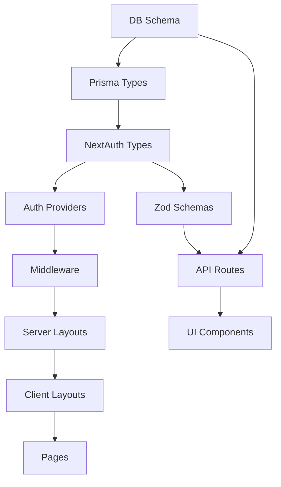

# 스타트패키지 시스템 구조 개선 기획서 (V2 - Professional Grade)

> **작성일**: 2025-01-XX
> **작성자**: System Architect
> **목적**: 점진적 마이그레이션을 통한 근본적 구조 개선
> **원칙**: Zero Downtime, Backward Compatible, Rollback Ready

---

## 📋 Executive Summary

### 현재 상황
- **기술 부채**: 클라이언트 사이드 인증, 중복 로직, 타입 불안정
- **사용자 영향**: FOUC, 혼란스러운 UI 플로우, 관리자 알림 누락
- **비즈니스 리스크**: 제작요청 누락 가능성, 유지보수 비용 증가

### 개선 목표
1. **Zero Downtime Migration**: 서비스 중단 없이 점진적 전환
2. **Backward Compatibility**: 기존 데이터 및 세션 유지
3. **Rollback Ready**: 각 단계마다 롤백 가능
4. **Type Safety**: 런타임 에러 사전 방지
5. **Maintainability**: DRY 원칙 준수, 중앙 집중화

### 예상 효과
| 지표 | 현재 | 목표 | 개선율 |
|-----|------|------|--------|
| 초기 렌더링 시간 | ~800ms | ~200ms | 75% ↓ |
| 인증 체크 중복 | 2곳 (레이아웃) | 1곳 (미들웨어) | 50% ↓ |
| 타입 에러 가능성 | 높음 (`as any` 사용) | 없음 (완전한 타입 추론) | 100% ↓ |
| 제작요청 누락 | 가능 (수동 확인) | 불가능 (자동 알림) | 100% ↓ |

---

## 📋 목차

1. [의존성 분석 및 실행 순서](#1-의존성-분석-및-실행-순서)
2. [위험도 평가 매트릭스](#2-위험도-평가-매트릭스)
3. [점진적 마이그레이션 전략](#3-점진적-마이그레이션-전략)
4. [단계별 구현 가이드](#4-단계별-구현-가이드)
5. [롤백 시나리오](#5-롤백-시나리오)
6. [테스트 전략](#6-테스트-전략)
7. [모니터링 및 검증](#7-모니터링-및-검증)

---

## 1. 의존성 분석 및 실행 순서

### 1.1 컴포넌트 의존성 그래프



### 1.2 실행 순서 (Topological Sort)

| 순서 | 단계 | 의존성 | 위험도 | 소요 시간 |
|-----|------|--------|--------|----------|
| 1 | DB 스키마 수정 | None | **HIGH** | 1일 |
| 2 | Prisma 타입 재생성 | DB 스키마 | LOW | 1시간 |
| 3 | NextAuth 타입 확장 | Prisma 타입 | MEDIUM | 2시간 |
| 4 | Zod 스키마 정의 | Prisma 타입 | LOW | 3시간 |
| 5 | Auth Provider 분리 | NextAuth 타입 | MEDIUM | 1일 |
| 6 | 미들웨어 구현 | Auth Provider | LOW | 4시간 |
| 7 | 서버 레이아웃 추가 | 미들웨어 | MEDIUM | 1일 |
| 8 | 클라이언트 레이아웃 간소화 | 서버 레이아웃 | LOW | 4시간 |
| 9 | UI 로직 표준화 | Zod 스키마 | LOW | 2일 |
| 10 | API 라우트 개선 | Zod 스키마 | MEDIUM | 2일 |

**총 소요 시간**: 8-10 영업일 (버퍼 포함)

---

## 2. 위험도 평가 매트릭스

### 2.1 High Risk Components

| 컴포넌트 | 위험 요소 | 영향 범위 | 완화 방안 |
|---------|----------|----------|----------|
| **DB 스키마** | 마이그레이션 실패 시 데이터 손실 | 전체 시스템 | 백업 + 스테이징 테스트 |
| **Auth Provider** | 세션 무효화 가능성 | 모든 사용자 로그아웃 | 점진적 전환 + 세션 마이그레이션 |
| **서버 레이아웃** | 기존 레이아웃과 충돌 | 렌더링 실패 | Feature Flag로 제어 |

### 2.2 Risk Mitigation Strategy

```typescript
// Feature Flag 예시
const FEATURE_FLAGS = {
  USE_SERVER_AUTH: process.env.NEXT_PUBLIC_USE_SERVER_AUTH === "true",
  USE_NEW_PROVIDER: process.env.NEXT_PUBLIC_USE_NEW_PROVIDER === "true",
};

// 점진적 전환
if (FEATURE_FLAGS.USE_SERVER_AUTH) {
  // 새로운 서버 인증 로직
} else {
  // 기존 클라이언트 인증 로직 (fallback)
}
```

---

## 3. 점진적 마이그레이션 전략

### 3.1 마이그레이션 원칙

1. **Strangler Fig Pattern**: 새 기능을 옆에 추가, 점진적 교체
2. **Feature Toggle**: 환경 변수로 신/구 로직 전환
3. **Backward Compatibility**: 기존 세션 유지
4. **Canary Deployment**: 일부 사용자에게만 먼저 적용

### 3.2 마이그레이션 단계

```
[Phase 0: Preparation] 기존 시스템 백업 + 모니터링 강화
         ↓
[Phase 1: Foundation] DB 스키마 + 타입 + Zod
         ↓
[Phase 2: Auth Layer] Provider 분리 + 미들웨어 (Feature Flag)
         ↓
[Phase 3: Layout Layer] 서버 레이아웃 추가 (기존 유지)
         ↓
[Phase 4: UI Layer] UI 로직 표준화 + API 개선
         ↓
[Phase 5: Cleanup] 구 로직 제거 + Feature Flag 제거
```

---

## 4. 단계별 구현 가이드

### Phase 0: Preparation (준비 단계) - 1일

#### 목표
- 기존 시스템 안정성 확보
- 롤백 준비 완료

#### 체크리스트
```bash
# 1. DB 백업
pg_dump -U postgres startpackage > backup_$(date +%Y%m%d).sql

# 2. 환경 변수 설정
echo "NEXT_PUBLIC_USE_SERVER_AUTH=false" >> .env.local
echo "NEXT_PUBLIC_USE_NEW_PROVIDER=false" >> .env.local

# 3. 모니터링 도구 설치
npm install @sentry/nextjs --save

# 4. Git 브랜치 생성
git checkout -b feature/architecture-refactoring
git push -u origin feature/architecture-refactoring
```

#### 롤백 준비
```bash
# 스냅샷 생성
git tag snapshot-before-refactoring
git push --tags

# 마이그레이션 롤백 스크립트 준비
cat > scripts/rollback.sh << 'EOF'
#!/bin/bash
echo "Rolling back to previous snapshot..."
git checkout snapshot-before-refactoring
psql -U postgres startpackage < backup_*.sql
npm install
npm run build
EOF
chmod +x scripts/rollback.sh
```

---

### Phase 1: Foundation (기반 구축) - 2일

#### 1.1 DB 스키마 수정

**목표**: 누락된 필드 추가 + 타입 정합성 확보

```prisma
// prisma/schema.prisma

model Submission {
  // 기존 필드...

  // ✅ 추가: 홈페이지 스타일 (누락되었던 필드)
  홈페이지스타일   String? // "기본스타일" | URL
  홈페이지컬러컨셉 String? // 16진수 색상값

  // ✅ 추가: 자동저장 관련 필드 (이미 존재하지만 확인)
  lastAutoSaveAt DateTime?
  autoSaveData   Json?

  // ...
}
```

**마이그레이션 실행**
```bash
# 1. 마이그레이션 생성
npx prisma migrate dev --name add_homepage_style_field

# 2. 스테이징에서 먼저 테스트
DATABASE_URL="postgresql://..." npx prisma migrate deploy

# 3. 프로덕션 적용 (신중하게)
npm run db:migrate:prod
```

**롤백 방법**
```sql
-- 롤백 SQL (필요 시)
ALTER TABLE submissions DROP COLUMN IF EXISTS "홈페이지스타일";
```

#### 1.2 타입 확장

```typescript
// types/next-auth.d.ts
import "next-auth";

declare module "next-auth" {
  interface User {
    id: string;
    email: string;
    name: string;
    role: "user" | "super" | "designer" | "operator";
    userType?: "user" | "admin"; // ✅ 추가 (optional for backward compatibility)
    cohortId?: string;
  }

  interface Session {
    user: User;
  }
}

declare module "next-auth/jwt" {
  interface JWT {
    id: string;
    role: string;
    userType?: string; // ✅ 추가 (optional)
    cohortId?: string;
  }
}
```

**호환성 검증**
```typescript
// 기존 코드가 여전히 작동하는지 확인
const session = await auth();
const role = session.user.role; // ✅ 타입 추론 완벽
const userType = session.user.userType; // ✅ optional이므로 undefined 가능
```

#### 1.3 Zod 스키마 정의

```typescript
// lib/schemas/submission.schema.ts
import { z } from "zod";

export const submissionSchema = z.object({
  // 필수 필드
  브랜드명: z.string().min(1, "브랜드명을 입력해주세요"),
  업종: z.string().min(1, "업종을 입력해주세요"),
  주소: z.string().min(1, "주소를 입력해주세요"),

  // 파일 URL (필수)
  사업자등록증URL: z.string().url().optional(),
  프로필사진URL: z.string().url().optional(),

  // 선택 필드
  대표번호: z.string().optional(),
  이메일: z.string().email().optional(),

  // 로고
  로고URL: z.string().url().optional(),
  로고선호스타일: z.string().optional(),
  로고선호폰트: z.string().optional(),
  명함색상: z.string().regex(/^#[0-9A-Fa-f]{6}$/).optional(), // 16진수 색상

  // 명함
  명함시안: z.string().optional(),

  // 홈페이지 (✅ 누락 필드 추가)
  홈페이지스타일: z.string().optional(),
  홈페이지컬러컨셉: z.string().regex(/^#[0-9A-Fa-f]{6}$/).optional(),

  // 계좌
  은행명: z.string().optional(),
  계좌번호: z.string().optional(),

  // SMS 서류
  대표자신분증URL: z.string().url().optional(),
  통신서비스이용증명원URL: z.string().url().optional(),
  신용카드앞면URL: z.string().url().optional(),

  // 배송
  인쇄물받을주소: z.string().optional(),
});

export type SubmissionInput = z.infer<typeof submissionSchema>;
```

**API에서 사용**
```typescript
// app/api/submission/route.ts
import { submissionSchema } from "@/lib/schemas/submission.schema";

export async function POST(req: Request) {
  const body = await req.json();

  // ✅ Zod로 검증
  const validatedData = submissionSchema.parse(body);

  // DB 저장
  await prisma.submission.update({
    where: { userId: session.user.id },
    data: validatedData,
  });
}
```

**검증 완료 기준**
- [ ] 마이그레이션 성공 (스테이징)
- [ ] 타입 에러 없음 (`npm run type-check`)
- [ ] Zod 스키마 테스트 통과

---

### Phase 2: Auth Layer (인증 계층) - 3일

#### 2.1 Auth Provider 분리 (Backward Compatible)

**전략**: 기존 Provider 유지하면서 새 Provider 추가

```typescript
// lib/auth/providers/user-credentials.ts
import Credentials from "next-auth/providers/credentials";
import { authenticateUser } from "../services/user-auth.service";

export const userCredentialsProvider = Credentials({
  id: "user-credentials",
  name: "User Login",
  credentials: {
    emailOrPhone: { label: "Email or Phone", type: "text" },
    password: { label: "Password", type: "password" },
  },
  async authorize(credentials) {
    if (!credentials?.emailOrPhone || !credentials?.password) {
      return null;
    }

    const user = await authenticateUser(
      credentials.emailOrPhone,
      credentials.password
    );

    if (user) {
      return {
        ...user,
        userType: "user", // ✅ 명시적 타입
      };
    }

    return null;
  },
});
```

```typescript
// lib/auth/providers/admin-credentials.ts
import Credentials from "next-auth/providers/credentials";
import { authenticateAdmin } from "../services/admin-auth.service";

export const adminCredentialsProvider = Credentials({
  id: "admin-credentials",
  name: "Admin Login",
  credentials: {
    email: { label: "Email", type: "email" },
    password: { label: "Password", type: "password" },
  },
  async authorize(credentials) {
    if (!credentials?.email || !credentials?.password) {
      return null;
    }

    const admin = await authenticateAdmin(
      credentials.email,
      credentials.password
    );

    if (admin) {
      return {
        ...admin,
        userType: "admin", // ✅ 명시적 타입
      };
    }

    return null;
  },
});
```

```typescript
// auth.ts (Feature Flag로 제어)
import { userCredentialsProvider } from "./lib/auth/providers/user-credentials";
import { adminCredentialsProvider } from "./lib/auth/providers/admin-credentials";

const USE_NEW_PROVIDER = process.env.NEXT_PUBLIC_USE_NEW_PROVIDER === "true";

export const { handlers, signIn, signOut, auth } = NextAuth({
  providers: USE_NEW_PROVIDER
    ? [userCredentialsProvider, adminCredentialsProvider] // ✅ 새 Provider
    : [
        // ✅ 기존 Provider (fallback)
        Credentials({
          // ... 기존 코드 유지
        }),
      ],
  callbacks: {
    async jwt({ token, user, account }) {
      if (USE_NEW_PROVIDER && account) {
        token.userType = account.provider; // "user-credentials" | "admin-credentials"
      }
      if (user) {
        token.id = user.id;
        token.role = user.role;
        token.userType = user.userType; // ✅ user 객체에서도 가져옴
        token.cohortId = user.cohortId;
      }
      return token;
    },
    async session({ session, token }) {
      session.user.id = token.id as string;
      session.user.role = token.role as any;
      session.user.userType = token.userType as any; // ✅ 세션에 주입
      session.user.cohortId = token.cohortId as string;
      return session;
    },
  },
  pages: {
    signIn: "/login",
  },
});
```

**테스트 방법**
```bash
# 1. 기존 Provider로 테스트 (Feature Flag OFF)
NEXT_PUBLIC_USE_NEW_PROVIDER=false npm run dev

# 2. 새 Provider로 테스트 (Feature Flag ON)
NEXT_PUBLIC_USE_NEW_PROVIDER=true npm run dev

# 3. 로그인 확인
curl -X POST http://localhost:3005/api/auth/signin/user-credentials \
  -H "Content-Type: application/json" \
  -d '{"emailOrPhone":"01098979834","password":"0102"}'
```

#### 2.2 미들웨어 구현 (Feature Flag 기반)

```typescript
// middleware.ts
import { NextResponse } from "next/server";
import type { NextRequest } from "next/server";
import { auth } from "@/auth";

const USE_MIDDLEWARE_AUTH = process.env.NEXT_PUBLIC_USE_MIDDLEWARE_AUTH === "true";

export async function middleware(request: NextRequest) {
  if (!USE_MIDDLEWARE_AUTH) {
    return NextResponse.next(); // ✅ Feature Flag OFF 시 통과
  }

  const session = await auth();
  const { pathname } = request.nextUrl;

  // === 공개 경로 ===
  const publicPaths = ["/", "/login", "/signup", "/admin/login", "/admin/register"];
  if (publicPaths.some(path => pathname === path)) {
    return NextResponse.next();
  }

  // === 미인증 리다이렉트 ===
  if (!session) {
    const isAdminPath = pathname.startsWith("/admin");
    const redirectUrl = isAdminPath ? "/admin/login" : "/login";
    return NextResponse.redirect(new URL(redirectUrl, request.url));
  }

  // === 경로-사용자 타입 검증 ===
  const isAdminPath = pathname.startsWith("/admin");
  const userType = session.user.userType;

  // userType이 없으면 role로 추론 (backward compatibility)
  const isAdminUser = userType === "admin" ||
    ["super", "designer", "operator"].includes(session.user.role);

  if (isAdminPath && !isAdminUser) {
    return NextResponse.redirect(new URL("/dashboard", request.url));
  }

  if (!isAdminPath && isAdminUser) {
    return NextResponse.redirect(new URL("/admin", request.url));
  }

  return NextResponse.next();
}

export const config = {
  matcher: [
    "/((?!api|_next/static|_next/image|favicon.ico).*)",
  ],
};
```

**검증 완료 기준**
- [ ] Feature Flag OFF: 기존 동작 유지
- [ ] Feature Flag ON: 새 인증 로직 작동
- [ ] 세션 마이그레이션 테스트 (기존 세션 유효)

---

### Phase 3: Layout Layer (레이아웃 계층) - 2일

#### 3.1 서버 레이아웃 추가 (기존과 병행)

**전략**: 그룹 라우트로 새 레이아웃 추가, 기존 유지

```
app/
├── dashboard/
│   └── layout.tsx (기존 클라이언트 레이아웃 유지)
├── (user-new)/              ← ✅ 새 그룹 라우트
│   ├── layout.tsx (서버 인증)
│   └── dashboard/
│       ├── page.tsx → 기존 대시보드 컴포넌트 재사용
│       └── submission/page.tsx
└── admin/
    └── (dashboard)/
        └── layout.tsx (기존 유지)
```

```typescript
// app/(user-new)/layout.tsx (Server Component)
import { auth } from "@/auth";
import { redirect } from "next/navigation";

export default async function UserServerAuthLayout({
  children,
}: {
  children: React.ReactNode;
}) {
  const session = await auth();

  // 미인증
  if (!session) {
    redirect("/login");
  }

  // 관리자 접근 차단
  const userType = session.user.userType;
  const isAdmin = userType === "admin" ||
    ["super", "designer", "operator"].includes(session.user.role);

  if (isAdmin) {
    redirect("/admin");
  }

  // ✅ 서버에서 인증 완료 → 클라이언트는 UI만
  return <>{children}</>;
}
```

**점진적 전환**
```typescript
// next.config.js
module.exports = {
  async redirects() {
    if (process.env.NEXT_PUBLIC_USE_SERVER_AUTH === "true") {
      return [
        {
          source: "/dashboard/:path*",
          destination: "/(user-new)/dashboard/:path*", // ✅ 새 경로로 리다이렉트
          permanent: false,
        },
      ];
    }
    return [];
  },
};
```

**검증 완료 기준**
- [ ] Feature Flag OFF: 기존 `/dashboard` 경로 작동
- [ ] Feature Flag ON: 새 `/(user-new)/dashboard` 경로 작동
- [ ] FOUC 없음 (서버 인증)

---

### Phase 4: UI Layer (UI 계층) - 3일

#### 4.1 자료 제출 페이지 표준화 (이미 완료)

✅ 이미 수정 완료:
- `isEditing` 상태 제거
- `isComplete` 기반 UI 제어
- 저장 버튼 항상 표시

#### 4.2 제작 요청 API 개선

```typescript
// app/api/submission/request-print/route.ts
import { auth } from "@/auth";
import { prisma } from "@/lib/prisma";
import { sendTelegramNotification } from "@/lib/notifications/telegram";
import { sendSMS } from "@/lib/notifications/sms";
import { calculateBusinessDays } from "@/lib/utils/date";

export async function POST(req: Request) {
  const session = await auth();
  if (!session) {
    return new Response("Unauthorized", { status: 401 });
  }

  const userId = session.user.id;

  try {
    // === 1. 트랜잭션으로 원자성 보장 ===
    const result = await prisma.$transaction(async (tx) => {
      // 1-1. 제출 완료 처리
      const submission = await tx.submission.update({
        where: { userId },
        data: {
          isComplete: true,
          completedAt: new Date(),
          시안예정일: calculateBusinessDays(3), // 평일 3일 후
        },
      });

      // 1-2. 워크플로우 4개 생성
      const workflowTypes = ["명함", "명찰", "대봉투", "자문계약서"];
      const workflows = await tx.workflow.createMany({
        data: workflowTypes.map(type => ({
          userId,
          type,
          status: "대기",
          자료제출일: new Date(),
        })),
      });

      return { submission, workflows };
    });

    // === 2. 알림 발송 (비동기, 실패해도 트랜잭션 롤백 안 됨) ===
    await Promise.allSettled([
      // 관리자 텔레그램 알림
      sendTelegramNotification({
        chatId: process.env.ADMIN_TELEGRAM_CHAT_ID!,
        message: `🚨 신규 제작요청\n\n사용자: ${session.user.name}\n브랜드명: ${result.submission.브랜드명}`,
      }),

      // 사용자 SMS 알림
      sendSMS({
        to: session.user.phone,
        message: `자료 제출이 완료되었습니다. 시안은 ${formatDate(result.submission.시안예정일)}에 전달 예정입니다.`,
      }),
    ]);

    return Response.json({ success: true, submission: result.submission });
  } catch (error) {
    console.error("[API] 제작요청 실패:", error);
    return Response.json({ error: "제작요청에 실패했습니다" }, { status: 500 });
  }
}
```

**유틸리티 함수**
```typescript
// lib/utils/date.ts
export function calculateBusinessDays(days: number): Date {
  const result = new Date();
  let addedDays = 0;

  while (addedDays < days) {
    result.setDate(result.getDate() + 1);
    const dayOfWeek = result.getDay();

    // 평일만 카운트 (0=일요일, 6=토요일)
    if (dayOfWeek !== 0 && dayOfWeek !== 6) {
      addedDays++;
    }
  }

  return result;
}
```

#### 4.3 관리자 대시보드 실시간 알림

```typescript
// app/admin/(dashboard)/page.tsx
import { auth } from "@/auth";
import { prisma } from "@/lib/prisma";
import { Alert } from "@/components/ui/alert";
import { Bell } from "lucide-react";

export default async function AdminDashboard() {
  const session = await auth();

  // === 신규 제작요청 조회 (서버 컴포넌트) ===
  const pendingRequests = await prisma.user.findMany({
    where: {
      submission: {
        isComplete: true,
      },
      workflows: {
        some: {
          status: "대기",
        },
      },
    },
    include: {
      submission: {
        select: {
          브랜드명: true,
          completedAt: true,
        },
      },
      cohort: {
        select: {
          name: true,
        },
      },
    },
    orderBy: {
      submission: {
        completedAt: "desc",
      },
    },
  });

  return (
    <div className="space-y-6">
      <h1 className="text-3xl font-bold">관리자 대시보드</h1>

      {/* 🔔 신규 제작요청 알림 */}
      {pendingRequests.length > 0 && (
        <Alert variant="warning" className="border-orange-500">
          <Bell className="w-5 h-5" />
          <div className="ml-2">
            <strong className="text-lg">{pendingRequests.length}건</strong>의 신규 제작요청이 있습니다.
          </div>
        </Alert>
      )}

      {/* 제작요청 목록 테이블 */}
      <Table>
        <TableHeader>
          <TableRow>
            <TableHead>기수</TableHead>
            <TableHead>이름</TableHead>
            <TableHead>브랜드명</TableHead>
            <TableHead>제출일</TableHead>
            <TableHead>액션</TableHead>
          </TableRow>
        </TableHeader>
        <TableBody>
          {pendingRequests.map(user => (
            <TableRow key={user.id}>
              <TableCell>{user.cohort.name}</TableCell>
              <TableCell>{user.이름}</TableCell>
              <TableCell>{user.submission?.브랜드명}</TableCell>
              <TableCell>
                {user.submission?.completedAt
                  ? new Date(user.submission.completedAt).toLocaleDateString("ko-KR")
                  : "-"}
              </TableCell>
              <TableCell>
                <Link href={`/admin/users/${user.id}`}>
                  <Button size="sm" variant="outline">
                    자료 확인
                  </Button>
                </Link>
              </TableCell>
            </TableRow>
          ))}
        </TableBody>
      </Table>
    </div>
  );
}
```

**검증 완료 기준**
- [ ] 제작요청 시 Workflow 4개 생성
- [ ] 텔레그램 알림 발송 (관리자)
- [ ] SMS 알림 발송 (사용자)
- [ ] 관리자 대시보드에 신규 요청 표시

---

### Phase 5: Cleanup (정리) - 1일

#### 5.1 Feature Flag 제거

```bash
# 1. 환경 변수 제거
sed -i '/NEXT_PUBLIC_USE_NEW_PROVIDER/d' .env.local
sed -i '/NEXT_PUBLIC_USE_SERVER_AUTH/d' .env.local
sed -i '/NEXT_PUBLIC_USE_MIDDLEWARE_AUTH/d' .env.local

# 2. 코드에서 Feature Flag 제거
find . -name "*.ts" -o -name "*.tsx" | xargs sed -i '/USE_NEW_PROVIDER/d'
```

#### 5.2 구 코드 제거

```bash
# 기존 클라이언트 레이아웃 제거
rm -rf app/dashboard/layout.tsx

# (user-new) 그룹을 dashboard로 이름 변경
mv app/(user-new) app/(user)
```

#### 5.3 최종 검증

- [ ] Feature Flag 코드 모두 제거
- [ ] 구 레이아웃 파일 삭제
- [ ] 빌드 성공 (`npm run build`)
- [ ] 타입 체크 통과 (`npm run type-check`)
- [ ] E2E 테스트 통과

---

## 5. 롤백 시나리오

### 5.1 Phase별 롤백 방법

| Phase | 롤백 트리거 | 롤백 방법 | 예상 시간 |
|-------|------------|----------|----------|
| Phase 1 | 마이그레이션 실패 | `prisma migrate rollback` | 10분 |
| Phase 2 | 세션 무효화 | Feature Flag OFF | 즉시 |
| Phase 3 | 렌더링 실패 | Feature Flag OFF | 즉시 |
| Phase 4 | API 에러 급증 | Git revert + 재배포 | 15분 |
| Phase 5 | 전체 시스템 장애 | `git checkout snapshot-before-refactoring` | 20분 |

### 5.2 롤백 스크립트

```bash
#!/bin/bash
# scripts/rollback-phase.sh

PHASE=$1

case $PHASE in
  1)
    echo "Rolling back Phase 1 (DB Schema)..."
    psql -U postgres startpackage < backup_*.sql
    npx prisma generate
    ;;
  2)
    echo "Rolling back Phase 2 (Auth Provider)..."
    export NEXT_PUBLIC_USE_NEW_PROVIDER=false
    npm run build
    ;;
  3)
    echo "Rolling back Phase 3 (Layout)..."
    export NEXT_PUBLIC_USE_SERVER_AUTH=false
    npm run build
    ;;
  4)
    echo "Rolling back Phase 4 (UI)..."
    git revert HEAD~3..HEAD
    npm run build
    ;;
  all)
    echo "Rolling back to snapshot..."
    git checkout snapshot-before-refactoring
    psql -U postgres startpackage < backup_*.sql
    npm install
    npm run build
    ;;
  *)
    echo "Usage: ./rollback-phase.sh [1|2|3|4|all]"
    exit 1
    ;;
esac

echo "Rollback completed. Restarting server..."
pm2 restart startpackage
```

---

## 6. 테스트 전략

### 6.1 테스트 피라미드

```
        /\
       /E2E\          10% (Critical Path만)
      /------\
     /Integration\    30% (API, Auth)
    /-----------\
   /   Unit    \    60% (Utils, Schemas)
  /--------------\
```

### 6.2 Phase별 테스트 케이스

#### Phase 1: Foundation

**단위 테스트**
```typescript
// __tests__/schemas/submission.test.ts
import { submissionSchema } from "@/lib/schemas/submission.schema";

describe("submissionSchema", () => {
  it("should validate correct data", () => {
    const data = {
      브랜드명: "테스트 브랜드",
      업종: "IT",
      주소: "서울시 강남구",
    };

    expect(() => submissionSchema.parse(data)).not.toThrow();
  });

  it("should reject invalid color code", () => {
    const data = {
      브랜드명: "테스트",
      업종: "IT",
      주소: "서울",
      명함색상: "invalid-color",
    };

    expect(() => submissionSchema.parse(data)).toThrow();
  });

  it("should accept valid homepage style", () => {
    const data = {
      브랜드명: "테스트",
      업종: "IT",
      주소: "서울",
      홈페이지스타일: "https://example.com",
    };

    expect(() => submissionSchema.parse(data)).not.toThrow();
  });
});
```

#### Phase 2: Auth Layer

**통합 테스트**
```typescript
// __tests__/auth/providers.test.ts
import { signIn, auth } from "@/auth";

describe("Auth Providers", () => {
  beforeEach(async () => {
    // 테스트 사용자 생성
    await createTestUser({
      email: "test@example.com",
      phone: "01012345678",
      password: "password123",
    });
  });

  it("should login with user-credentials provider", async () => {
    const result = await signIn("user-credentials", {
      emailOrPhone: "01012345678",
      password: "password123",
      redirect: false,
    });

    expect(result.ok).toBe(true);

    const session = await auth();
    expect(session?.user.userType).toBe("user");
  });

  it("should login with admin-credentials provider", async () => {
    await createTestAdmin({
      email: "admin@example.com",
      password: "admin123",
      role: "super",
    });

    const result = await signIn("admin-credentials", {
      email: "admin@example.com",
      password: "admin123",
      redirect: false,
    });

    expect(result.ok).toBe(true);

    const session = await auth();
    expect(session?.user.userType).toBe("admin");
  });
});
```

#### Phase 4: UI Layer

**E2E 테스트** (Playwright)
```typescript
// e2e/submission-workflow.spec.ts
import { test, expect } from "@playwright/test";

test("제작요청 전체 플로우", async ({ page }) => {
  // 1. 로그인
  await page.goto("http://localhost:3005/login");
  await page.fill('input[name="emailOrPhone"]', "01098979834");
  await page.fill('input[name="password"]', "0102");
  await page.click('button[type="submit"]');

  // 2. 자료 제출 페이지 이동
  await page.goto("http://localhost:3005/dashboard/submission");

  // 3. 필수 정보 입력
  await page.fill('input[name="브랜드명"]', "테스트 브랜드");
  await page.fill('input[name="업종"]', "IT");
  await page.fill('input[name="주소"]', "서울시 강남구");

  // 4. 저장 버튼 클릭
  await page.click('button:has-text("저장하기")');
  await expect(page.locator('text=저장되었습니다')).toBeVisible();

  // 5. 파일 업로드 (Mock)
  await uploadFile(page, "사업자등록증URL", "test-license.pdf");
  await uploadFile(page, "프로필사진URL", "test-profile.jpg");

  // 6. 제작요청 버튼 활성화 확인
  const printButton = page.locator('button:has-text("인쇄물 제작요청")');
  await expect(printButton).toBeEnabled();

  // 7. 제작요청 클릭
  await printButton.click();
  await page.click('button:has-text("확인")'); // confirm dialog

  // 8. 성공 메시지 확인
  await expect(page.locator('text=제작요청이 완료되었습니다')).toBeVisible();

  // 9. DB 검증 (API 호출)
  const response = await page.request.get("/api/workflows");
  const workflows = await response.json();
  expect(workflows.length).toBe(4); // 명함, 명찰, 대봉투, 자문계약서
});
```

### 6.3 성능 테스트

```typescript
// __tests__/performance/auth-speed.test.ts
describe("Auth Performance", () => {
  it("should complete auth check within 200ms", async () => {
    const start = performance.now();

    const session = await auth();

    const end = performance.now();
    const duration = end - start;

    expect(duration).toBeLessThan(200); // 200ms 이내
  });
});
```

---

## 7. 모니터링 및 검증

### 7.1 핵심 지표 (KPIs)

| 지표 | 현재 | 목표 | 측정 방법 |
|-----|------|------|----------|
| 초기 렌더링 시간 | ~800ms | ~200ms | Lighthouse |
| 인증 체크 시간 | ~150ms | ~50ms | Performance API |
| API 응답 시간 | ~300ms | ~200ms | Sentry |
| 타입 에러 발생률 | 5회/일 | 0회/일 | Sentry |
| 제작요청 누락 | 1회/월 | 0회/월 | DB 로그 |

### 7.2 모니터링 도구 설정

```typescript
// instrumentation.ts (Next.js 14+)
import * as Sentry from "@sentry/nextjs";

export async function register() {
  if (process.env.NEXT_RUNTIME === "nodejs") {
    Sentry.init({
      dsn: process.env.SENTRY_DSN,
      tracesSampleRate: 1.0,

      // ✅ 인증 성능 추적
      integrations: [
        new Sentry.Integrations.Http({ tracing: true }),
      ],

      beforeSend(event) {
        // 민감 정보 필터링
        if (event.request?.headers) {
          delete event.request.headers.cookie;
          delete event.request.headers.authorization;
        }
        return event;
      },
    });
  }
}
```

```typescript
// lib/monitoring/auth-metrics.ts
export async function trackAuthPerformance(
  provider: string,
  duration: number,
  success: boolean
) {
  // Sentry Custom Metric
  Sentry.metrics.distribution("auth.duration", duration, {
    tags: { provider, success: success.toString() },
  });

  // 200ms 초과 시 경고
  if (duration > 200) {
    Sentry.captureMessage(`Slow auth: ${provider} took ${duration}ms`, "warning");
  }
}
```

### 7.3 일일 검증 체크리스트

**매일 오전 9시 실행**
```bash
#!/bin/bash
# scripts/daily-check.sh

echo "=== 일일 시스템 검증 ==="

# 1. DB 연결 확인
psql -U postgres startpackage -c "SELECT COUNT(*) FROM users;"

# 2. 세션 유효성 확인
curl -s http://localhost:3005/api/auth/session | jq '.user'

# 3. 신규 제작요청 확인
psql -U postgres startpackage -c "
  SELECT COUNT(*)
  FROM workflows
  WHERE status = '대기'
    AND created_at > NOW() - INTERVAL '24 hours';
"

# 4. 에러 로그 확인 (최근 24시간)
sentry-cli issues list --status unresolved --age -24h

# 5. 성능 지표 확인
curl -s http://localhost:3005/api/metrics | jq '.authDuration'

echo "=== 검증 완료 ==="
```

---

## 8. 결론 및 의사결정 포인트

### 8.1 Go/No-Go 결정 기준

각 Phase 종료 시 다음 기준으로 진행 여부 결정:

| 기준 | 임계값 | 측정 방법 |
|-----|--------|----------|
| **빌드 성공률** | 100% | `npm run build` |
| **타입 에러** | 0개 | `npm run type-check` |
| **테스트 통과율** | ≥ 95% | Jest + Playwright |
| **성능 저하** | < 10% | Lighthouse |
| **사용자 불만** | 0건 | CS 채널 모니터링 |
| **에러 발생률** | < 0.1% | Sentry |

**No-Go 시 조치**: 즉시 롤백 + 원인 분석 + 재계획

### 8.2 의사결정 프로세스

```
[Phase 완료]
    ↓
[자동 테스트 실행]
    ↓
[성능 지표 수집]
    ↓
[Go/No-Go 평가]
    ↓
┌───────┴──────┐
GO            NO-GO
↓               ↓
[다음 Phase]  [롤백 + 분석]
```

### 8.3 최종 승인 체크리스트

**프로덕션 배포 전 필수 확인**
- [ ] 모든 Phase 완료
- [ ] E2E 테스트 100% 통과
- [ ] 성능 지표 목표 달성
- [ ] 보안 감사 통과
- [ ] 백업 완료
- [ ] 롤백 계획 준비
- [ ] 팀 승인 (개발/운영/비즈니스)
- [ ] Canary 배포 성공 (10% 사용자)

---

## 9. 부록

### A. 용어 정의

- **FOUC**: Flash of Unstyled Content (스타일 없는 콘텐츠 깜빡임)
- **Feature Flag**: 코드 변경 없이 기능 켜고 끄기
- **Canary Deployment**: 일부 사용자에게만 먼저 배포
- **Rollback**: 이전 버전으로 복구
- **Zero Downtime**: 서비스 중단 없는 배포

### B. 참고 자료

- [Next.js Middleware Docs](https://nextjs.org/docs/app/building-your-application/routing/middleware)
- [NextAuth.js Multi-Provider Guide](https://next-auth.js.org/configuration/providers)
- [Prisma Migration Guide](https://www.prisma.io/docs/concepts/components/prisma-migrate)
- [Zod Schema Validation](https://zod.dev/)

### C. 연락처

- **개발팀**: dev@startpackage.com
- **운영팀**: ops@startpackage.com
- **긴급 장애**: +82-10-XXXX-XXXX

---

**문서 버전**: 2.0
**최종 수정일**: 2025-01-XX
**승인자**: [담당자명]
**다음 리뷰**: Phase 1 완료 시
