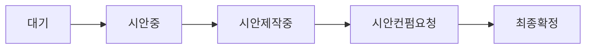
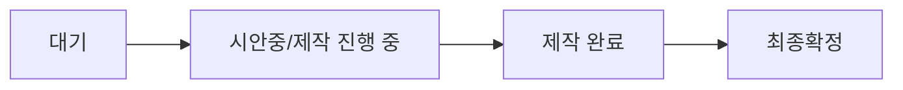
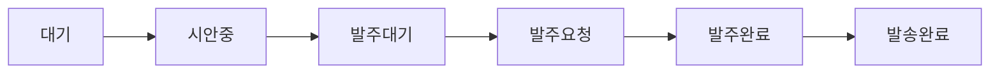

# 워크플로우 상태 관리

## 📋 개요

제작물별로 다른 워크플로우 상태 및 프로세스 관리

## 🎨 로고 워크플로우

### 상태 흐름



### 상태별 설명

| 상태 | 설명 | 사용자 액션 | 관리자 액션 |
|------|------|-------------|-------------|
| 대기 | 자료 미제출 | - | - |
| 시안중 | 자료 제출 완료, 시안 작업 시작 | - | 시안 업로드 |
| 시안제작중 | 시안 작업 진행 중 | - | - |
| 시안컨펌요청 | 시안 완성, 사용자 확인 대기 | **시안 확정** 또는 피드백 | 피드백 확인 |
| 최종확정 | 로고 시안 최종 확정 | - | - |

### 관련 API

- `POST /api/workflows/{id}/approve` - 시안 확정
- `POST /api/workflows/{id}/feedback` - 피드백 제출

## 🏠 홈페이지 워크플로우

### 상태 흐름



### 상태별 설명

| 상태 | 설명 | 사용자 액션 | 관리자 액션 |
|------|------|-------------|-------------|
| 대기 | 자료 미제출 | - | - |
| 시안중 (UI: 제작 진행 중) | 자료 제출 완료, 홈페이지 제작 시작 | - | URL 업로드 |
| 제작 완료 | 홈페이지 제작 완료 | **시안 확정** 또는 피드백 | 피드백 확인 |
| 최종확정 | 홈페이지 최종 확정 | - | - |

### 특이사항

- UI에서 "시안중" 상태를 "제작 진행 중"으로 표시
- 시안URL에 홈페이지 URL 저장
- 확정 후 소유권 이전 프로세스 진행

## 🖨️ 인쇄물 워크플로우

### 상태 흐름



### 상태별 설명

| 상태 | 설명 | 사용자 액션 | 관리자 액션 |
|------|------|-------------|-------------|
| 대기 | 자료 미제출 | - | - |
| 시안중 | 자료 제출 완료, 시안 작업 시작 | - | 시안 업로드 |
| 발주대기 | 시안 완성, 발주 확인 대기 | **발주 요청** 또는 피드백 | - |
| 발주요청 | 발주 요청됨, 관리자 승인 대기 | - | 발주 승인 |
| 발주완료 | 발주 승인, 인쇄 시작 | - | 택배 정보 입력 |
| 발송완료 | 택배 발송 완료 | - | - |

### 적용 대상

- 명함
- 명찰
- 대봉투
- 자문계약서 표지
- 자문계약서 내지

### 관련 API

- `POST /api/workflows/{id}/order` - 발주 요청
- `POST /api/workflows/{id}/feedback` - 피드백 제출

## 📊 상태 전환 매트릭스

### 사용자가 가능한 전환

| 현재 상태 | 가능한 액션 | 다음 상태 | 제작물 |
|-----------|-------------|-----------|--------|
| 시안컨펌요청 | 시안 확정 | 최종확정 | 로고 |
| 제작 완료 | 시안 확정 | 최종확정 | 홈페이지 |
| 발주대기 | 발주 요청 | 발주요청 | 인쇄물 |
| 모든 시안 상태 | 피드백 제출 | 상태 유지 | 전체 |

### 관리자가 가능한 전환

| 현재 상태 | 가능한 액션 | 다음 상태 | 제작물 |
|-----------|-------------|-----------|--------|
| 시안중 | 시안 업로드 | 시안제작중/발주대기 | 로고/인쇄물 |
| 시안중 | URL 등록 | 제작 완료 | 홈페이지 |
| 발주요청 | 발주 승인 | 발주완료 | 인쇄물 |
| 발주완료 | 택배 정보 입력 | 발송완료 | 인쇄물 |

## 🗄️ 데이터베이스 스키마

### Workflow 모델

```prisma
model Workflow {
  id     String @id @default(cuid())
  userId String
  type   String  // "로고", "홈페이지", "명함", etc.
  status String @default("대기")

  // 날짜 추적
  자료제출일   DateTime?
  시안업로드일 DateTime?
  발주요청일   DateTime?
  발주승인일   DateTime?
  예상도착일   String?  // "YYYY-MM-DD" 또는 "YYYY-MM-DD ~ YYYY-MM-DD"
  제작완료일   DateTime?
  발송일       DateTime?

  // 파일
  시안URL String?

  // 택배 정보
  택배회사   String?
  운송장번호 String?

  // 피드백
  feedback     String?
  feedbackDate DateTime?
  feedbackRead Boolean @default(false)

  // 수정 이력
  수정횟수 Int @default(0)
  시안이력 Json?

  createdAt DateTime @default(now())
  updatedAt DateTime @updatedAt
}
```

## 🎯 예상도착일 계산

### 적용 시점

1. **로고**: 자료제출일 기준 영업일 1~2일 (향후 구현 예정)
2. **인쇄물**: 발주요청일 기준 제작물별 영업일
   - 명함/명찰: 2~3일
   - 대봉투: 4~5일
   - 자문계약서: 7일

### 저장 형식

```typescript
// 범위
"2025-10-29 ~ 2025-10-30"

// 단일 날짜
"2025-11-05"
```

### 표시 형식

```typescript
// formatArrivalDate() 적용
"10월 29일 (화) ~ 10월 30일 (수)"
"11월 5일 (수)"
```

## 📝 상태별 UI 표시

### 뱃지 색상

```typescript
const statusMap = {
  "대기": { color: "text-gray-500", label: "대기" },
  "시안중": { color: "text-blue-700 bg-blue-50", label: "시안 작업 중" },
  "시안컨펌요청": { color: "text-orange-700 bg-orange-50", label: "시안 컨펌 요청" },
  "발주대기": { color: "text-orange-700 bg-orange-50", label: "발주 대기 (확인 필요!)" },
  "발주요청": { color: "text-yellow-700 bg-yellow-50", label: "발주 요청" },
  "발주완료": { color: "text-green-800 bg-green-50", label: "발주 완료" },
  "발송완료": { color: "text-teal-800 bg-teal-50", label: "발송 완료" },
  "최종확정": { color: "text-emerald-800 bg-emerald-50", label: "최종 확정" },
  "제작 완료": { color: "text-green-800 bg-green-50", label: "제작 완료" },
};
```

## 🔔 알림 발송

### 상태 변경 시 알림

- **시안 업로드**: SMS/이메일 발송
- **발주 요청**: 텔레그램 + 슬랙 알림
- **발송 완료**: SMS + 택배 정보 포함

## 🔗 관련 문서

- [[영업일 계산 규칙]]
- [[2025-10-27 워크플로우 예정일 및 시안 확정 기능]]
- [[파일 업로드 (Cloudflare R2)]]
